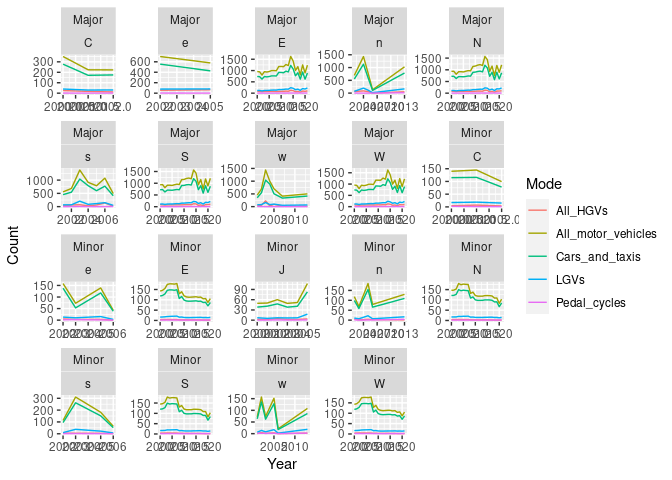

<!-- README.md is generated from README.Rmd. Please edit that file -->

# dfttraffic

<!-- badges: start -->
<!-- badges: end -->

The goal of dfttraffic is to explore DfT’s road traffic datasets.

``` r
library(tidyverse)
library(tidymodels)
```

``` r
u_data_raw = "https://storage.googleapis.com/dft-statistics/road-traffic/downloads/data-gov-uk/dft_traffic_counts_raw_counts.zip"
f = basename(u_data_raw)
if(!file.exists(f)) {
  download.file(url = u_data_raw, destfile = f)
}
```

``` r
raw_traffic_data = readr::read_csv("dft_traffic_counts_raw_counts.csv")
#> Rows: 4657464 Columns: 35
#> ── Column specification ────────────────────────────────────────────────────────
#> Delimiter: ","
#> chr  (10): Direction_of_travel, Region_name, Region_ons_code, Local_authorit...
#> dbl  (24): Count_point_id, Year, hour, Region_id, Local_authority_id, Eastin...
#> dttm  (1): Count_date
#> 
#> ℹ Use `spec()` to retrieve the full column specification for this data.
#> ℹ Specify the column types or set `show_col_types = FALSE` to quiet this message.
dim(raw_traffic_data)
#> [1] 4657464      35
```

``` r
raw_traffic_data
#> # A tibble: 4,657,464 × 35
#>    Count_point…¹ Direc…²  Year Count_date           hour Regio…³ Regio…⁴ Regio…⁵
#>            <dbl> <chr>   <dbl> <dttm>              <dbl>   <dbl> <chr>   <chr>  
#>  1         37778 S        2011 2011-06-07 00:00:00    11      10 West M… E12000…
#>  2         37778 S        2011 2011-06-07 00:00:00    12      10 West M… E12000…
#>  3         37778 S        2011 2011-06-07 00:00:00    13      10 West M… E12000…
#>  4         37778 S        2011 2011-06-07 00:00:00    14      10 West M… E12000…
#>  5         37778 S        2011 2011-06-07 00:00:00    15      10 West M… E12000…
#>  6         37778 S        2011 2011-06-07 00:00:00    16      10 West M… E12000…
#>  7         37778 S        2011 2011-06-07 00:00:00    17      10 West M… E12000…
#>  8         37780 E        2011 2011-09-14 00:00:00     7      10 West M… E12000…
#>  9         37780 E        2011 2011-09-14 00:00:00     8      10 West M… E12000…
#> 10         37780 E        2011 2011-09-14 00:00:00     9      10 West M… E12000…
#> # … with 4,657,454 more rows, 27 more variables: Local_authority_id <dbl>,
#> #   Local_authority_name <chr>, Local_authority_code <chr>, Road_name <chr>,
#> #   Road_category <chr>, Road_type <chr>, Start_junction_road_name <chr>,
#> #   End_junction_road_name <chr>, Easting <dbl>, Northing <dbl>,
#> #   Latitude <dbl>, Longitude <dbl>, Link_length_km <dbl>,
#> #   Link_length_miles <dbl>, Pedal_cycles <dbl>,
#> #   Two_wheeled_motor_vehicles <dbl>, Cars_and_taxis <dbl>, …
```

The code above shows we have 4.7 million rows of data.

A logical starting point is to plot the mean flows for each major mode
of transport each year. This is done below.

``` r
raw_traffic_mean_year = raw_traffic_data |>
  group_by(Year) |> 
  summarise(across(.cols = matches("Ped|Car|All|LGV"), mean, na.rm = TRUE)) |> 
  pivot_longer(cols = -Year, names_to = "Mode", values_to = "Count")
raw_traffic_mean_year |> 
  ggplot(aes(Year, Count, colour = Mode)) +
  geom_line()
```

<!-- -->

On their own, these results do not mean much: changes in counter
locations accounted for more of the variability than actual changes in
traffic. Disaggregating the results by road type leads to the following:

``` r
raw_traffic_mean_year = raw_traffic_data |>
  group_by(Year, Road_type) |> 
  summarise(across(.cols = matches("Ped|Car|All|LGV"), mean, na.rm = TRUE)) |> 
  pivot_longer(cols = c(-Year, -Road_type), names_to = "Mode", values_to = "Count")
#> `summarise()` has grouped output by 'Year'. You can override using the
#> `.groups` argument.
raw_traffic_mean_year |> 
  ggplot(aes(Year, Count, colour = Mode)) +
  geom_line() +
  facet_wrap(~Road_type, scales = "free")
```

<!-- -->

``` r
raw_traffic_mean_year = raw_traffic_data |>
  group_by(Year, Road_type) |> 
  summarise(across(.cols = matches("Ped|Car|All|LGV"), mean, na.rm = TRUE)) |> 
  pivot_longer(cols = c(-Year, -Road_type), names_to = "Mode", values_to = "Count")
#> `summarise()` has grouped output by 'Year'. You can override using the
#> `.groups` argument.
raw_traffic_mean_year |> 
  ggplot(aes(Year, Count, colour = Mode)) +
  geom_line() +
  facet_wrap(~Road_type, scales = "free")
```

<!-- -->

We will remove records with no estimates for motor vehicles:

``` r
traffic_data_no_na = raw_traffic_data |> 
  filter(!is.na(All_motor_vehicles))
```

Let’s exclude count points that only appear than n times or less to
remove the impact of points that are only used once.

``` r
traffic_data_n_years = traffic_data_no_na |> 
  group_by(Count_point_id, Direction_of_travel) |> 
  mutate(
    year_number = length(unique(Year)),
    first_year = min(Year),
    last_year = max(Year)
    )
traffic_data_n_years |> 
  select(matches("year")) |> 
  summary()
#> Adding missing grouping variables: `Count_point_id`, `Direction_of_travel`
#>  Count_point_id   Direction_of_travel      Year       year_number    
#>  Min.   :    51   Length:4657449      Min.   :2000   Min.   : 1.000  
#>  1st Qu.: 46294   Class :character    1st Qu.:2005   1st Qu.: 3.000  
#>  Median :806701   Mode  :character    Median :2010   Median : 7.000  
#>  Mean   :525493                       Mean   :2010   Mean   : 7.269  
#>  3rd Qu.:945110                       3rd Qu.:2016   3rd Qu.:10.000  
#>  Max.   :999999                       Max.   :2021   Max.   :22.000  
#>    first_year     last_year   
#>  Min.   :2000   Min.   :2000  
#>  1st Qu.:2000   1st Qu.:2009  
#>  Median :2003   Median :2019  
#>  Mean   :2005   Mean   :2016  
#>  3rd Qu.:2009   3rd Qu.:2019  
#>  Max.   :2021   Max.   :2021
```

``` r
traffic_data_n_years |> 
  filter(year_number == 22) |> 
  group_by(Year, Road_type) |> 
  summarise(across(.cols = matches("Ped|Car|All|LGV"), mean, na.rm = TRUE)) |> 
  pivot_longer(cols = c(-Year, -Road_type), names_to = "Mode", values_to = "Count") |> 
  ggplot(aes(Year, Count, colour = Mode)) +
  geom_line() +
  facet_wrap(~Road_type, scales = "free")
#> `summarise()` has grouped output by 'Year'. You can override using the
#> `.groups` argument.
```

<!-- -->

``` r
traffic_data_n_years_near_full = traffic_data_n_years |> 
  filter(Year >= 2009) |> 
    group_by(Count_point_id, Direction_of_travel) |> 
  mutate(
    year_number = length(unique(Year)),
    first_year = min(Year),
    last_year = max(Year)
    ) |> 
  # filter(year_number >= 12) |> # full sample
  filter(year_number >= 11) # near full sample
table(traffic_data_n_years_near_full$Road_type) # 284k minor records
#> 
#>  Major  Minor 
#>  52824 284460

traffic_data_n_years_near_full |> 
  group_by(Year, Road_type) |> 
  summarise(across(.cols = matches("Ped|Car|All|LGV"), mean, na.rm = TRUE)) |> 
  pivot_longer(cols = c(-Year, -Road_type), names_to = "Mode", values_to = "Count") |> 
  ggplot(aes(Year, Count, colour = Mode)) +
  geom_line() +
  facet_wrap(~Road_type, scales = "free") +
  scale_x_continuous(breaks = c(2010, 2015, 2020))
#> `summarise()` has grouped output by 'Year'. You can override using the
#> `.groups` argument.
```

<!-- -->

Bayesian estimate of change in traffic over time
<https://journal.r-project.org/archive/2018/RJ-2018-017/RJ-2018-017.pdf>

``` r
traffic_data_sample = traffic_data_no_na |> 
  sample_n(100)
traffic_grouped_sample = traffic_data_no_na |> 
  filter(Count_point_id %in% traffic_data_sample$Count_point_id)
library(brms)
fit = traffic_grouped_sample |> 
  brm(All_motor_vehicles ~ Year + (1 | Count_point_id), data = _)
```

<!-- Given the variability in site locations, it makes sense to compare change in traffic levels against predictions that exclude time. -->
<!-- Let's do this for all motor vehicles first, with [{tidymodels}](https://www.tidymodels.org/learn/models/parsnip-ranger-glmnet/) providing an interface to the {ranger} package: -->

That shows that a model that excludes time and location is pretty good:
just contextual variables can explain 65% of variability in results. We
will predict the number of motor vehicles on a random sample of records
to generate a measure of goodness of fit:
